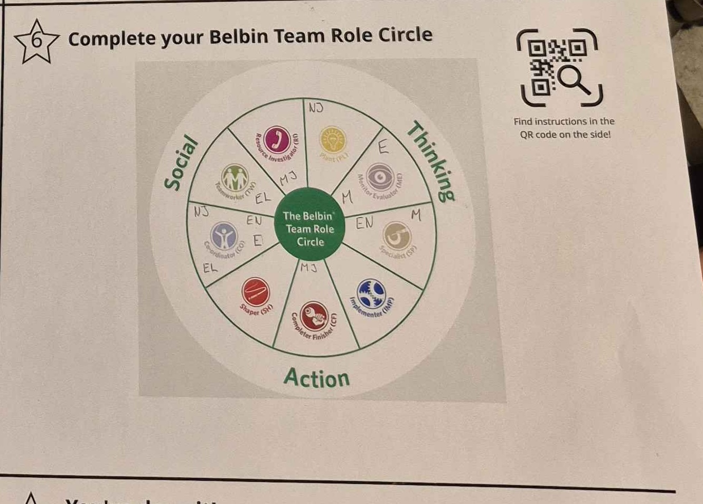
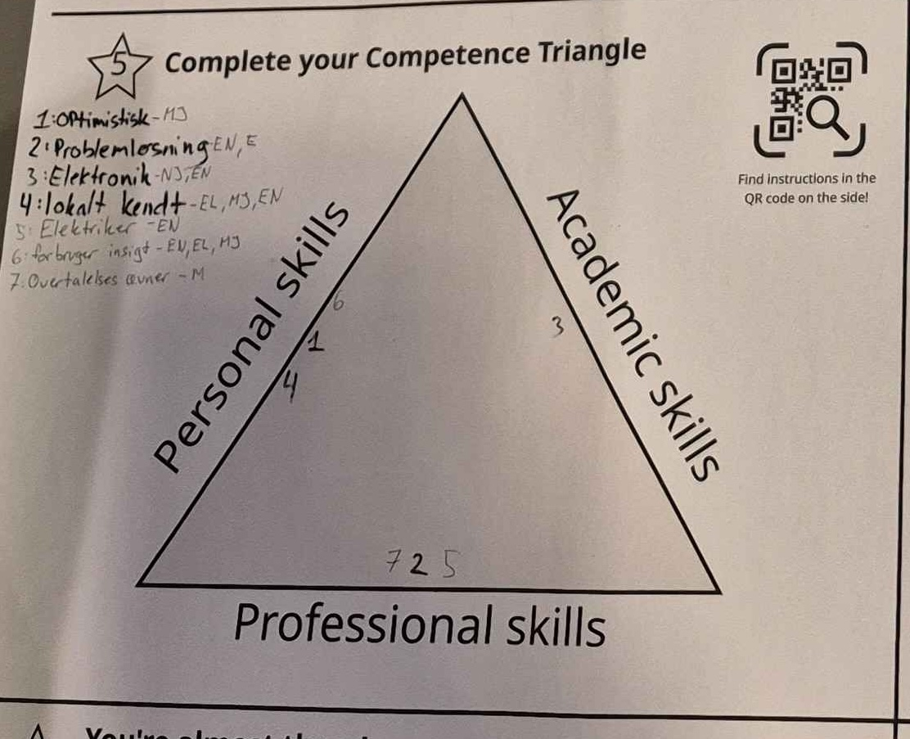

<!-- font_size: 3 -->

Highlights from meeting
===

- No giant wind (or solar) farms
- Avoid stress on power-grid
- Preferably wind-energy or solar + storage
- Focus outside of Roskilde city
- Expensive to expand power-grid
- Lacking citizen support
- Preserve nature
<!-- new_lines: 5 -->
<!-- pause -->
# Problem Statement
What stops the residents in the municipality from taking part in a
energy community - And what can Roskilde Municipality do to facilitate this?

<!-- end_slide -->
<!-- font_size: 3 -->

Belbin Team Circle
===

We are missing a shaper and an implementer

How can we solve this?
<!-- pause --> 
By being aware and wary of having to cover for this lack of roles.

<!-- end_slide -->
<!-- font_size: 3 -->
Competence Triangle
===
<!-- column_layout: [1, 1] -->
<!-- column: 0 -->

- Optimism
- Problem solving
- Electronics
- Knowledge of the area
- Electrician
- Consumer Insight
- Convincing Skills

<!-- column: 1 -->

<!-- end_slide -->
<!-- font_size: 3 -->
What's next?
===

We have chosen Gundsømagle as a test city.
As it's located in the northern part of Roskilde Municipality where almost all nature is preserved.

# Research
- Green energy- production and storage solutions
- Existing Energy Communities
- - Nationally
- - Internationally

# Interview
- Residents about concerns regarding implementation of a green energy community
- - Residents who are producing power and those who don't (YET)

<!-- end_slide -->
<!-- font_size: 3 -->

Fun Facts
===

- Mikkel is technically old enough to be Emils dad...
- We all like pizza
- 5 Executives and a driver, perfect for a bank robbery

